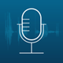
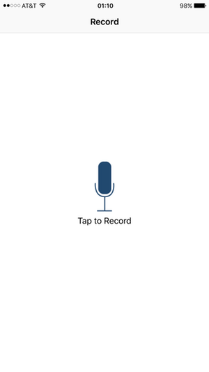
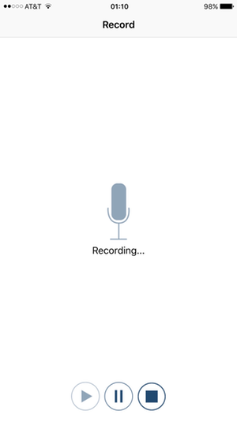
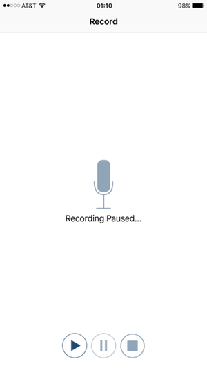
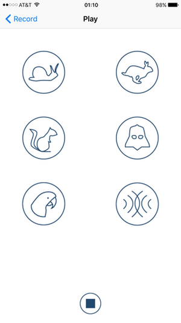

# &nbsp;&nbsp;&nbsp;&nbsp;&nbsp;PitchPerfect

PitchPerfect allows the user to record sound via the device microphone, and then replay that sound modulated in a fashion chosen by the user.

## Project

PitchPerfect is Portfolio Project #1 of the Udacity iOS Developer Nanodegree Program.  The following list contains pertinent course documents:  

* [Udacity App Specification](./Paperwork/Udacity/UdacityAppSpecification.pdf)  
* [Udacity Code Improvements](./Paperwork/Udacity/UdacityCodeImprovements.pdf)
* [Udacity Grading Rubric](./Paperwork/Udacity/UdacityGradingRubric.pdf)  
* [GitHub Swift Style Guide](./Paperwork/Udacity/GitHubSwiftStyleGuide.pdf)  
* [Udacity Git Commit Message Style Guide](./Paperwork/Udacity/UdacityGitCommitMessageStyleGuide.pdf)  
* [Udacity Project & Code Reviews](https://review.udacity.com/#!/reviews/48019)<br/><br/>

|               | Project Submission          | Currently
| :---          | :---                        | :---      |
| Grade:        |  ***Exceeds Expectations*** |           |  
| App Version:  | 1.0                         | 1.1&nbsp;&nbsp;(GH tag v1.1.1)&nbsp;&nbsp;&nbsp;&nbsp;&nbsp;&nbsp;[changelog](./Paperwork/READMEFiles/ChangeLog.md)|
| Environment:  | Xcode 7.0.1 / iOS 9.0       | Xcode 7.2.1 / iOS 9.2 |
| Devices:      | iPhone Only                 | No Change |
| Orientations: | Portrait Only               | No Change |

## Design

### Record View

TABLE 1 - Record View States

| Tap to Record | Recording... | Recording Paused... |
| :---:         | :---:        | :---:               |
|  |  |  |

TABLE 2 - Recording Control Buttons

| Resume | Pause | Stop  |
| :---:  | :---: | :---: |
|  |  |  |

* The Record View is the initial view after app launch (TABLE 1 - **Tap to Record**).<br/><br/>
* Tap the active microphone icon to start recording:  
  - The view transitions to look like TABLE 1 - **Recording...**
  - Icons that are "greyed out" are inactive and will not respond to a tap<br/><br/>
* While recording, tap the **Pause** button to pause recording:
  - The view transitions to look like TABLE 1 - **Recording Paused...**
  - Resume button becomes active, pause/stop buttons become inactive.<br/><br/>
* While recording, tap the **Stop** button to stop recording:
  - Recording function is terminated
  - The view transitions to the Playback View.<br/><br/>
* While recording is paused, tap the **Resume** button to continue recording:
  - New audio will be appended to previously recorded audio
  - Resume button becomes inactive, pause/stop buttons become active.<br/><br/>

### Playback View

TABLE 3 - Playback View

| Play                                      | 
| :---:                           |                      
|  |

TABLE 4 - Playback Effects Buttons

| Snail  | Rabbit | Chipmunk | Darth Vader | Hawk  | Reverb |
| :---:  | :---:  | :---:    | :---:       | :---: | :---:  | 
|  |  |  |  |  | 

* Tap the **Snail** button to play the original audio at one-half the recording speed, making the audio sound slower.
* Tap the **Rabbit** button to play the original audio at twice the recording speed, making the audio sound faster.
* Tap the **Chipmunk** button to play the original audio with pitch one octave higher than the original, making the audio sound higher.
* Tap the **Darth Vader** button to play the original audio with pitch one octave lower that the original, making the audio sound lower.
* Tap the **Hawk** button to play the original audio with an [echo](https://en.wikipedia.org/wiki/Echo) based on a one-second delay.
* Tap the **Reverb** button to play the original audio with a [reverberation](https://en.wikipedia.org/wiki/Reverberation) containing the acoustic characteristics of a medium-sized hall environment, using a [wet-dry mix](http://www.differencebetween.net/technology/difference-between-wet-and-dry-signals-or-sounds/) of 50%.
* During playback, tap the **Stop** button to terminate playback<br/><br/>
* During playback, tap an effect button to terminate the current playback, and restart playback with the new effect.
* At any time, tap the **< Record** button (in the navigation bar) to terminate playback (if active) and return to the **Tap to Record** state of the **Record View**.

### iOS Developer Libraries In Use

* [AVFoundation](./Paperwork/READMEFiles/AVFoundation.md)
* [Foundation](./Paperwork/READMEFiles/Foundation.md)
* [UIKit](./Paperwork/READMEFiles/UIKit.md)

### Protocols Implemented

```
AVAudioRecorderDelegate
UIApplicationDelegate
```

---
**Copyright © 2016 Gregory White. All rights reserved.**
